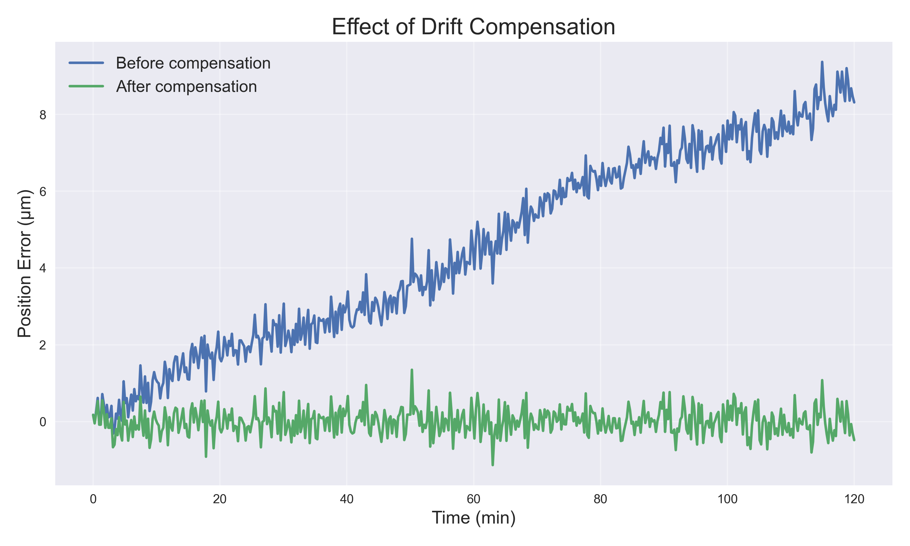
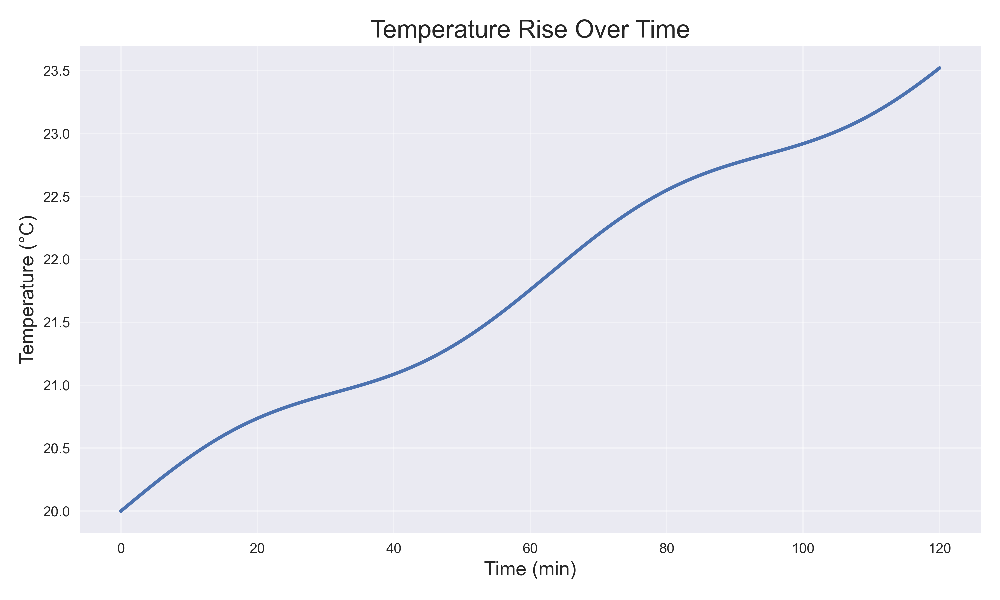
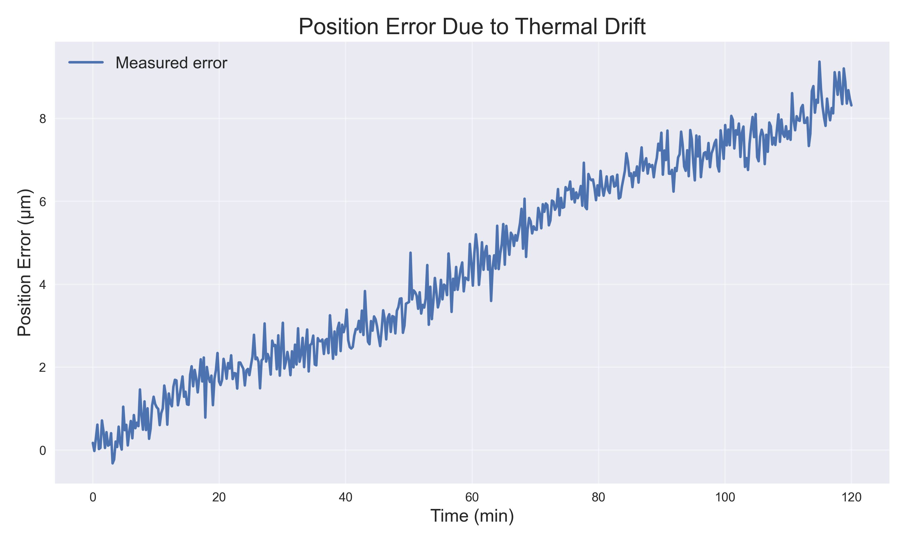
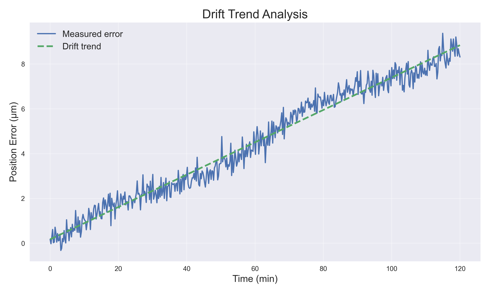
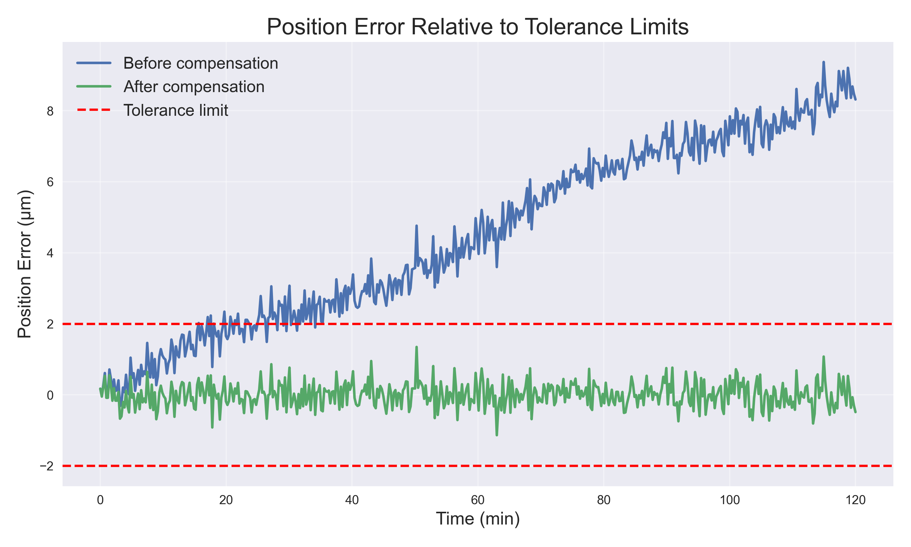

## Overview
	
Thermal drift is a major source of positioning error in precision machine tools during machine warm up. As structural components heat up, thermal expansion introduces systematic micron 
level deviations that degrade machining accuracy.This project implements a Python based simulation of the relationship between temperature rise and positioning error in a precision 
machine axis and evaluates a temperature based compensation strategy. Using numerical modelling and visual analysis, it illustrates how even a simple compensation model can 
significantly reduce positioning error during warm up.

## Project Visualization

*Position error before and after temperature based compensation during machine warm up.*

## Objectives
	
The project aims to:  
Model thermal drift caused by machine warm up.  
Analyze the relationship between temperature and positioning error.  
Implement a temperature based compensation strategy.  
Quantify how compensation improves positioning accuracy relative to a tolerance band.

## Modelling Approach
	
Thermal drift is modeled as a temperature dependent positioning error with added measurement noise.  
Drift Model: e(t) = k ⋅ (T(t) - T_ref ) + n(t)  
Where:  
e(t): measured position error (µm)  
k: thermal drift sensitivity (µm/°C)  
T(t): temperature at time t (°C)  
T_ref: reference temperature (°C)  
n(t): measurement noise (µm)  
Compensation Model - The compensation model subtracts the predicted drift from the measured error: e_comp(t) = e(t) - k ⋅ (T(t) - T_ref)

## Methodology
	
The workflow consists of the following steps:  
Temperature simulation - Simulate machine warm up as a gradual temperature increase over time with a small oscillatory component.  
Thermal drift generation - Compute the drift component as a linear function of temperature rise using the drift model.  
Noise modelling - Add zero mean Gaussian noise to represent measurement uncertainty.  
Drift trend estimation - Fit a linear regression trend to the error signal to visualize the systematic drift behaviour.  
Drift compensation - Apply a temperature based compensation model that removes the thermal drift component from the measured error.  
Tolerance evaluation - Evaluate position error before and after compensation relative to defined tolerance limits and compute key metrics.

## Results
	
The simulation shows that thermal expansion during machine warm up can induce several micrometers of positioning error.  
Key metrics (example run):  
Temperature rise: 3.52 °C  
Maximum drift before compensation: 9.37 µm  
Residual error after compensation: 1.35 µm  
Accuracy improvement based on max error: ≈ 85.6%  
After compensation, the systematic drift is largely removed and the residual positioning error remains close to zero for most of the warm up period, dominated mainly by measurement noise.

## Visualizations
	
The project generates several plots:  

Temperature Rise Over Time

*Simulated machine warm up showing gradual temperature increase over time.*  

Position Error Due to Thermal Drift

*Position error growth during machine warm up caused by temperature induced thermal expansion.*  

Drift Trend Analysis

*Measured position error with a fitted trend line highlighting systematic thermal drift.*  

Effect of Drift Compensation

*Comparison of position error before and after applying the temperature based compensation model.*  

Position Error Relative to Tolerance Limits

*Position error compared against tolerance limits to evaluate compliance after compensation.*

## Tools and Technologies
	
Python, NumPy, Pandas, Matplotlib, Power BI (for visual summary)

## Limitations and Possible Extensions

The model considers a single machine axis and a single virtual temperature sensor; real machine tools often use multiple sensor locations and more advanced models.
The drift sensitivity k is assumed known; in practice, it would be identified from calibration experiments.  
Compensation is applied offline to simulated data; in industrial applications, the model would feed into real time controller offsets or NC compensation tables.Possible extensions include multi sensor modelling, parameter identification from real measurement data, and integration with a control oriented compensation scheme.

